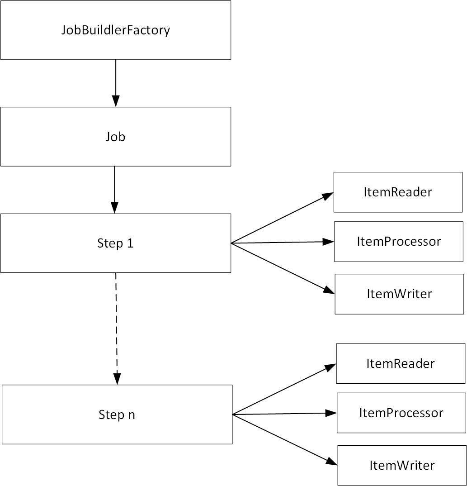

# Batch Processing Implementation using Spring Batch POC
POC using Spring Batch

## Technical Stack
* Java 1.8
* Maven
* Spring Boot Batch 2.1.0
* H2 InMemory Database 

## Notes
* `BatchConfiguration.java` is where defined a bean `importUserJob` as return Job.
* Use Command to run selective Job from application `mvn spring-boot:run -Dspring.batch.job.names=importUserJob,modifyUserJob`

## Batch Architecture
 

# Reference
* https://github.com/brettwooldridge/HikariCP - Light weight JDBC Connection Pool
